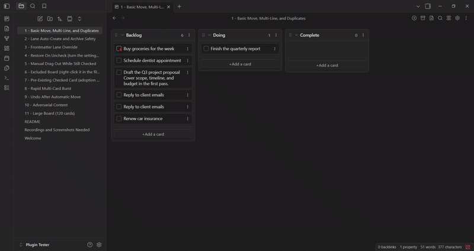
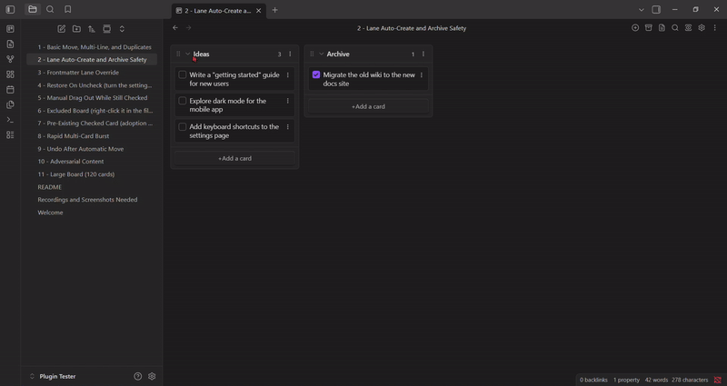
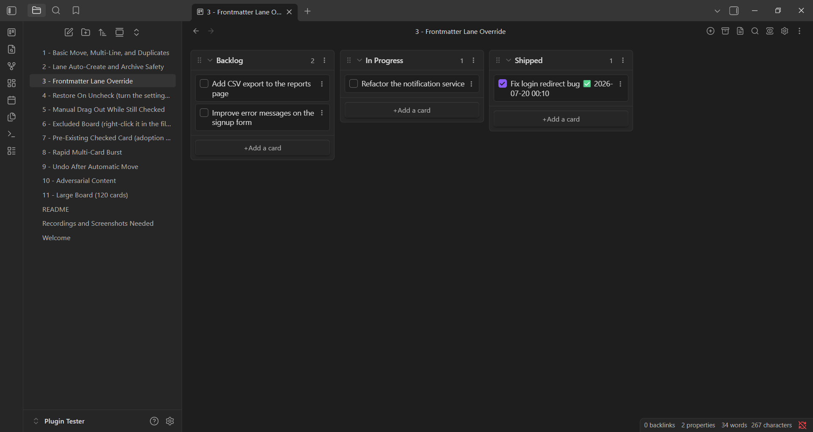
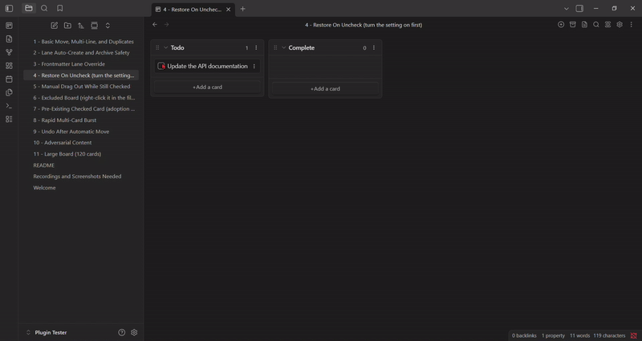
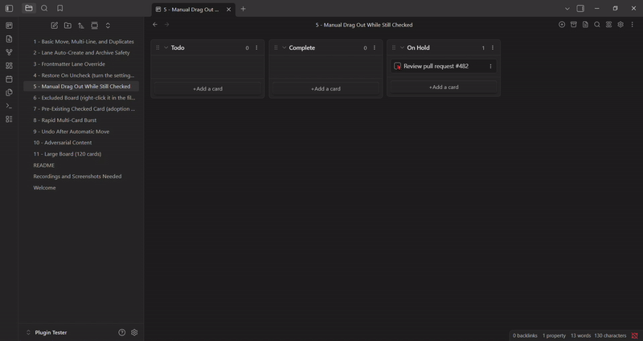
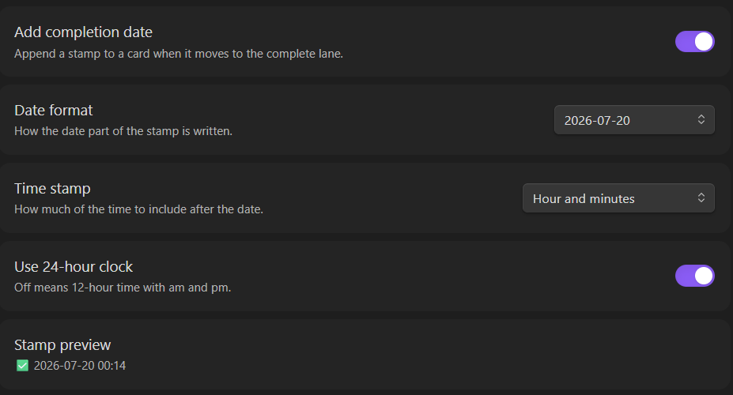
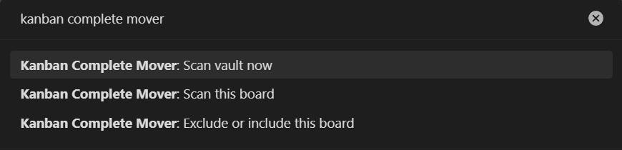
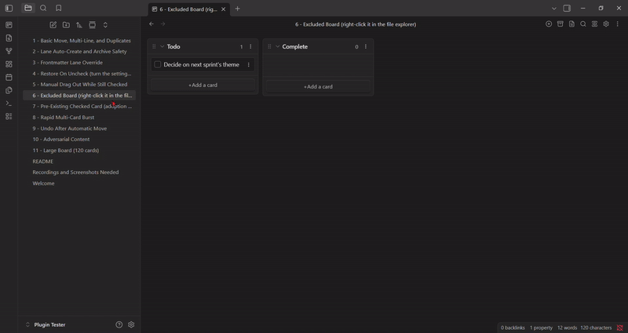

# Kanban Complete Mover

Move a Kanban card to your Complete lane the moment its checkbox is checked. No more dragging cards over by hand.



## What it does

This plugin watches your Kanban boards (the [Kanban plugin](https://github.com/mgmeyers/obsidian-kanban) by mgmeyers) and, once turned on, keeps one rule true: **a checked card belongs in your Complete lane.**

- Check a card anywhere else on the board and it moves there automatically.
- No Complete lane yet? One gets created for you, in the right spot.
- Uncheck a card while it's sitting in Complete and it can jump back to wherever it came from.
- Drag a checked card out of Complete by hand and it unchecks itself instead of fighting you and snapping back.
- Optionally stamp the date (and time) a card was completed.
- Nothing happens until you turn it on, and excluding a board takes one right-click, no typing.

## Installation

1. Open Settings -> Community plugins -> Browse, search for "Kanban Complete Mover," and install it.
2. Enable the plugin.
3. Open its settings and turn on "Enable automatic move."

## Features

### Move on check

Check any card, anywhere on the board, and it moves to your Complete lane. This is the core behavior and the only thing the plugin does by default.


### The Complete lane creates itself

Checking a card on a board with no Complete lane creates one automatically. It lands above an Archive section if the board has one, otherwise at the very bottom.



### Pick your own lane name, per board

The default target lane is named "Complete," set in the plugin's settings. A single board can use a different name by adding this to its frontmatter:

```yaml
---
kanban-plugin: board
kanban-complete-lane: Shipped
---
```

Checking a card on that board now sends it to a lane called "Shipped" instead. If that lane doesn't exist yet, it's created automatically, exactly like the default lane would be.



### Restore on uncheck

Off by default. Turn it on in settings and unchecking a card while it's sitting in your Complete lane sends it back to whichever lane it came from, with its completion stamp removed. Check it again later and it returns to Complete with a fresh stamp.



### Dragging a card out of Complete

If you manually drag a checked card out of Complete into another lane, the plugin doesn't fight you or snap it back. It just unchecks the card in place, wherever you dropped it.



### Completion date stamps

Off by default. Turn on "Add completion date" to append a timestamp to a card the moment it moves to Complete. Pick a date format from the dropdown, or "Custom" to type your own using [moment.js format tokens](https://momentjs.com/docs/#/displaying/format/). If you're not using a custom format, a separate dropdown lets you add a time component (none, hour, hour and minutes, or hour/minutes/seconds) in either 12-hour or 24-hour style. A live preview shows exactly what today's stamp would look like before you save anything.



### Adopting an existing vault safely

Already have checked cards scattered around your vault from before this plugin existed? Turning the automatic toggle on will **not** sweep through and move them all right away. Only boards you actually touch afterward get processed. When you're ready to bring your whole vault up to date deliberately, run **Kanban Complete Mover: Scan vault now** from the command palette. It processes every board at once and reports how many cards moved, restored, or unchecked.



Would rather adopt one board at a time and check the result before moving to the next? Open that board and run **Kanban Complete Mover: Scan this board** instead. Same idea, just scoped to whichever board is currently active. A board you've excluded stays untouched either way, running this command on one just tells you it's excluded rather than scanning it.

### Excluding a board

Right-click any board in the file explorer and choose **Exclude board from Kanban Complete Mover**. That board is now completely ignored, no matter what gets checked on it. Right-click again to bring it back with **Include board**. The same action is available as a command (**Exclude or include this board**) when the board is the active file. No path typing, no settings-file editing required.



## Settings reference

| Setting | Default | What it does |
|---|---|---|
| Enable automatic move | Off | Master switch. Nothing happens until this is on. |
| Complete lane name | `Complete` | The default target lane name. Override per board with `kanban-complete-lane` in that board's frontmatter. |
| Restore on uncheck | Off | Send a card back to its origin lane if unchecked while sitting in Complete. |
| Add completion date | Off | Stamp the date (and optionally time) a card moved to Complete. |
| Date format | `YYYY-MM-DD` | Preset dropdown, or Custom for a raw moment.js format string. |
| Time stamp | None | How much time detail to add after the date: none, hour, hour and minutes, or hour/minutes/seconds. |
| Use 24-hour clock | Off | 12-hour with am/pm when off. |
| Excluded boards | (empty) | Vault paths this plugin ignores entirely. Easiest edited via the right-click menu, not by typing here directly. |

## Frontmatter reference

| Key | Where | What it does |
|---|---|---|
| `kanban-complete-lane` | A board's own frontmatter | Overrides the global Complete lane name for that one board. |

## Good to know

- Archived cards (the base Kanban plugin's own Archive section) are never touched, moved, or scanned.
- Multi-line cards move as a whole block, continuation lines included.
- Duplicate cards with identical text are tracked individually. Checking one doesn't move the other.
- This plugin only edits plain Markdown checkboxes and lane headings. It doesn't touch anything outside the boards it's watching.
- Finding your Kanban boards means listing every file path in your vault (that's how "Scan vault now" and "Scan this board" work). The plugin only reads file paths and the Markdown content of actual boards, nothing else, and nothing ever leaves your vault: no network calls, no telemetry.

## Known limitations and compatibility notes

- **Undo does not apply to automatic moves.** This plugin writes to your board files outside Obsidian's own editor history, so Ctrl+Z (or Cmd+Z) has no record of a move it made and won't reverse one. That's normal for this category of plugin: Obsidian gives plugins no way to register their own writes on the undo stack, so none of them integrate with it.
- **Checking several cards in very fast succession can occasionally leave one behind, just once.** Under rapid-fire clicking, the underlying Kanban plugin can save its own view state at almost the same moment this plugin writes a move. Very rarely, the two land in an order that leaves a single card stuck. Checking and unchecking that card again resolves it immediately. The fix depends on a new file change to re-trigger a check, and there's no way to guarantee ordering against another plugin's own save cycle without hooking into its internals, which this plugin deliberately avoids for stability.
- **Manually dragging an unchecked card into your Complete lane does not check it off or add a stamp.** This plugin only reacts to a checkbox being checked. It never reacts to a card simply arriving in a lane. Want a card to auto-check itself on arrival instead? That's a different, already-existing feature: the base Kanban plugin's own per-lane "Mark cards in this list as complete" toggle. Turn that on for your Complete lane and the two plugins compose cleanly. Kanban checks the card off, and this plugin sees it's already exactly where it belongs and leaves it alone.
- **Restore on uncheck only works for cards this plugin itself moved.** A card that reached Complete some other way (a manual drag, or the native Kanban toggle above) was never given a recorded origin lane, so there's nothing to send it back to. Checking and unchecking a card like that in place does nothing, by design.
- **Mobile testing is limited to one Android device so far**, covering checkbox moves, restore on uncheck, and long-press to exclude a board. iOS hasn't been tested. If you run this on iPhone or iPad, an issue report either way (works or doesn't) is genuinely useful.
- **Fixed in 1.0.2: compatibility with the [Tasks](https://github.com/obsidian-tasks-group/obsidian-tasks) plugin.** This plugin's own completion stamp used the same checkmark emoji Tasks uses for its native done-date marker. Stripping the stamp and marker (dragging a card out of Complete while checked, cleaning it up while unchecked outside the target lane, or stripping it in place inside the lane) used to eat any unrelated checkmark text already on the card, including a real Tasks done-date, along with it. Now fixed: the card's pre-move content is recovered from this plugin's own marker instead of pattern-matched off the visible line, so anything else on the card, Tasks metadata included, survives untouched.

## Contributing

Issues and pull requests are welcome. This plugin has no external dependencies and makes no network calls. It reads and writes local Markdown files, nothing else.

## License

MIT
